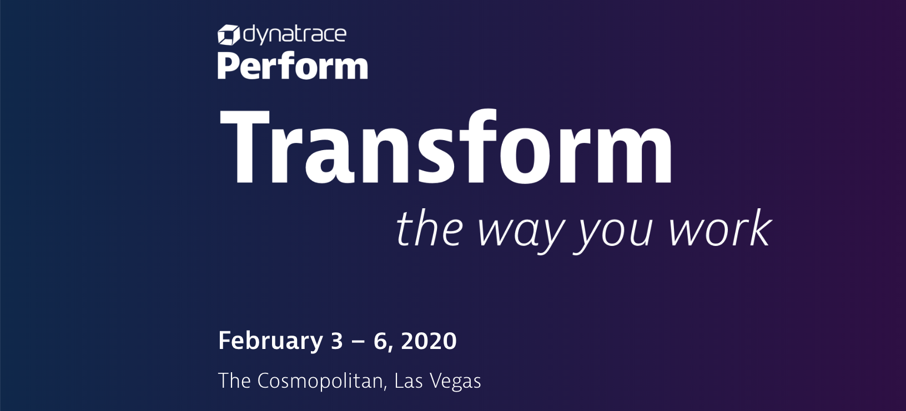

# Auto-Remediation with Ansible Tower

## Prerequisites
1. Create a API Token

1.1 Go to Settings -> Integration -> Dynatrace API and press the Generate Token Button
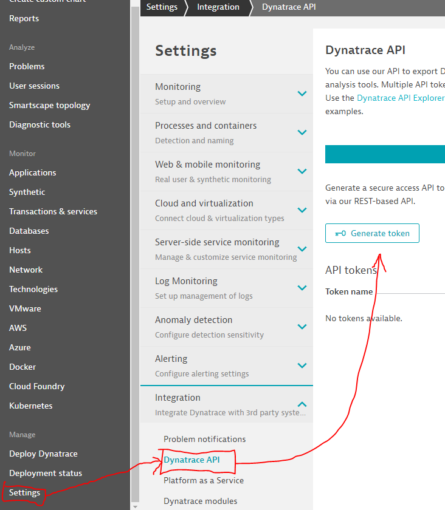

1.2 Name the Token "Perform2020" and enable all switches and press the Generate Button
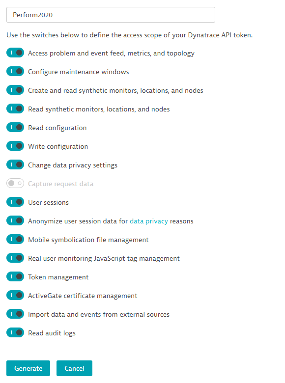

1.3 After generating the Token click on the edit arrow on the right side of the row and copy the API token and note it down.


2. Create a PaaS Token

2.1 Go to Settings -> Integration -> Platform as a Service and press the Generate Token Button
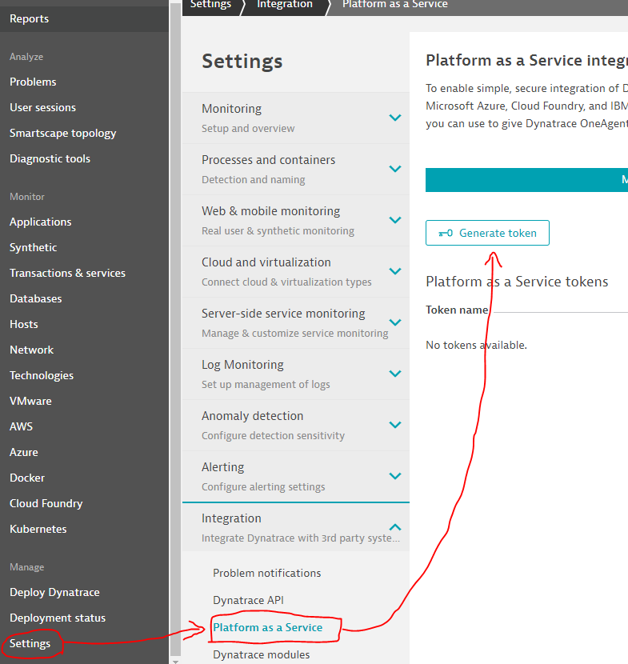

2.2 Name the Token "Perform2020" and press the Generate Button
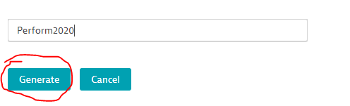

2.3 After generating the Token click on the edit arrow on the right side of the row and copy the API token and note it down.
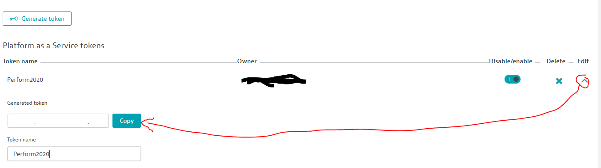


## Install tools and demo application

1. Login to the bastion host with your environment card

    ```console
    docker run -d --name ${USER} -it --mount type=bind,source=/home/${USER}/.kube/,target=/root/.kube/ jetzlstorfer/hotday-gke:0.6.0 && docker exec -it ${USER} /bin/bash
    ```

1. Go to the Ansible folder

    ```console
    cd ansible
    ```

1. Edit the creds.json file and provide your own credentials.

    ```console
    nano creds.json
    ```
    You can save by ctrl+o and exit with ctrl+x

1. Deploy the Dynatrace OneAgent Operator with this script:

    ```console
    ./1-deployDynatraceOperator.sh
    ```

1. Check if everything is up and running:
    ```console
    kubectl get pods -n dynatrace 
    ```

1. Deploy the demo application for our workshop with the provided script:
    ```console
    ./2-setupSockShop.sh 
    ```

1. Fetch the public IP address for the carts service and copy to a temporary file - we will need it later.
    ```console
    kubectl get services -n production
    ```

1. **STOP HERE FOR A MOMENT** The instructors will let you know when to proceed.

1. Setup the Ansible Tower with a provided script. This will setup Ansible Tower and configure some job templates that we will need for this workshop. 
    ```console
    ./3-installAnsible.sh
    ```
    Please save the following Ansible Job URL to a temporary file.

    In case you are running in any issues during this step, follow the troubleshooting guide at the end of this tutorial.

1. Open the Ansible Tower by copying the **Tower URL** to a new browser tab. The login credentials are `admin / dynatrace`. 

# Configure Dynatrace
    
1. Create tags in Dynatrace via **Settings -> Tags -> Automatically applied tags**

    1. Create a tag named "**app**"
        - Optional tag value: `{ProcessGroup:KubernetesContainerName}` 
        - Rule applies to: `process groups` 
        - Conditions: `Kubernetes container name` `exists`
        - Add checkmark for **Apply to all services provided by the process groups** 
        
        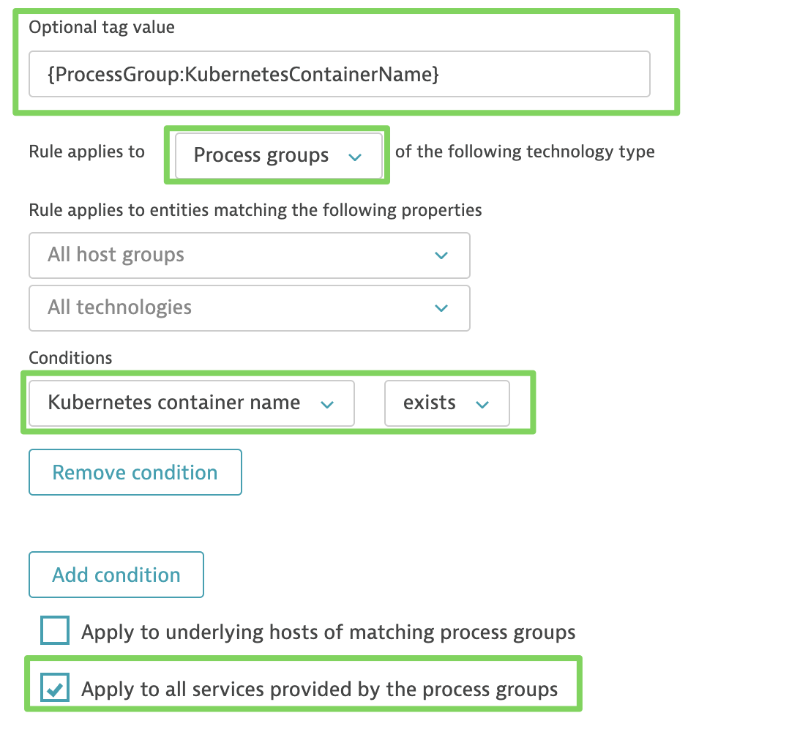


    1. Create a tag named "**environment**" 

        - Optional tag value: `{ProcessGroup:KubernetesNamespace}` 
        - Rule applies to: `process groups`
        - Conditions: `Kubernetes container name` `exists`
        - Add checkmark for **Apply to all services provided by the process groups** 

        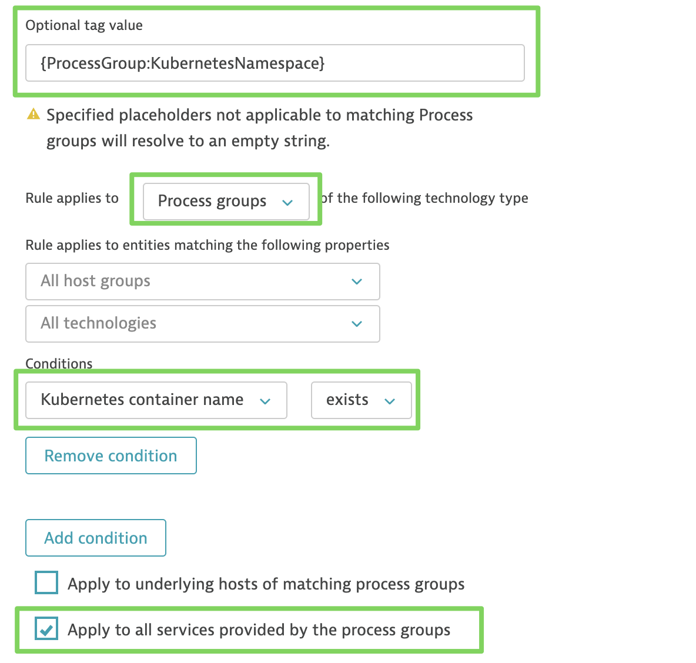
    

1. Create a Problem notification in Dynatrace via **Settings->Integrations-> Problem notifications -> Ansible**
    - Name: "Ansible Tower"
    - Template Url: insert the url of Step 4 here
    - Credentials: `admin / dynatrace`

    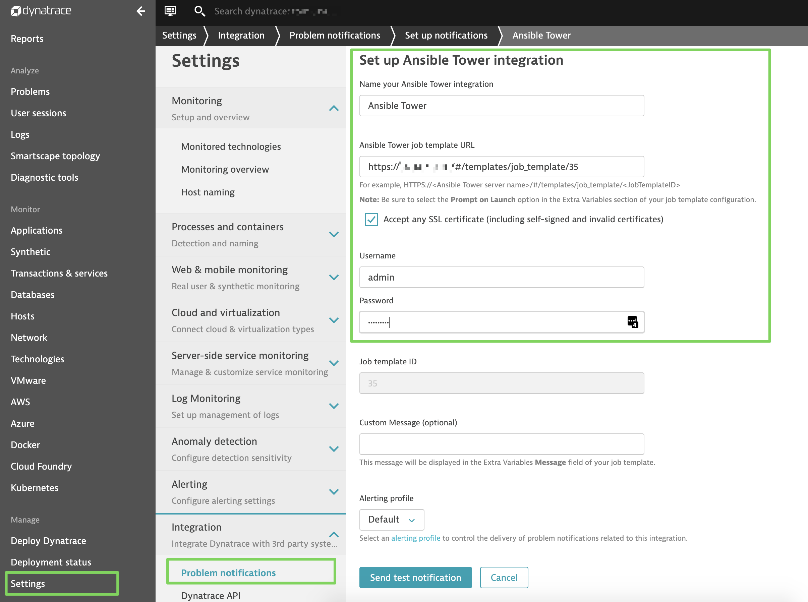


# Let's try to mess with the service

1. Start the load-generation script with this command. Please exchange the IP for the carts service you saved earlier in this tutorial.

    ```console
    ./add-to-cart.sh IP-OF-CARTS-SERVICE
    ```

1. Login to your Ansible Tower to start the prepared demo workflow. 

1. Navigate to the **Resources -> Templates** section and start the provided template named **start-campain**

    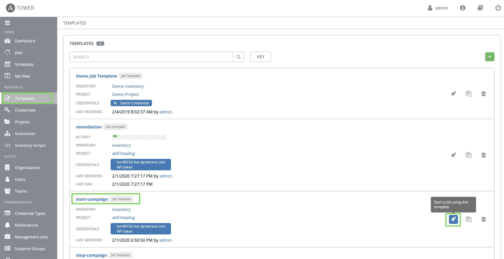

1. Change the **promotion rate** to **30** and **LAUNCH** the job template.

    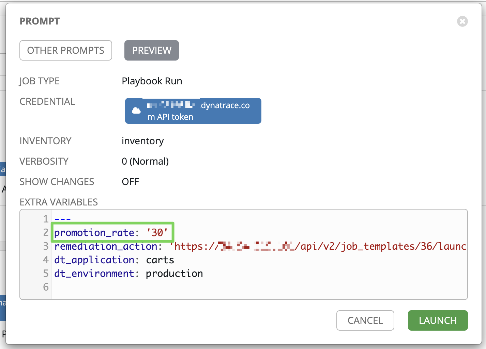

1. This will trigger a promotional campaign where 30 % of all user interactions of a shopping card _should_ receive a promotional item. Instead, what happens is that we will see an increase in the failure rate since the campaign has not been implemented yet. 

1. Watch the self-healing take place ;)


# Troubleshooting

- In case Ansible Tower did not successfully install, please execute the following script to delete the failed installation and to try again:
    ```console
    kubectl delete ns tower
    ```
    ```console
    ./3-installAnsible.sh
    ```
